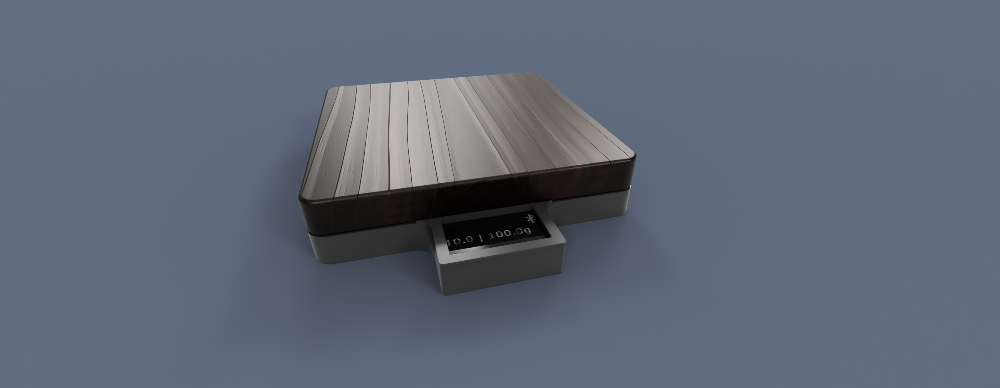
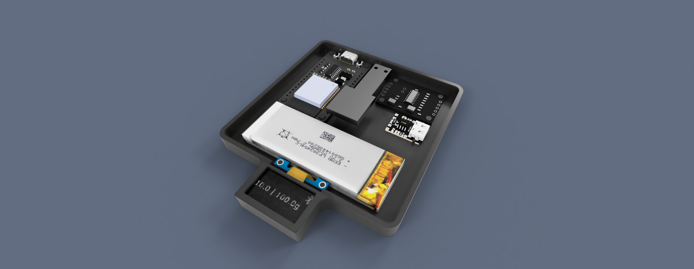

# inDecentScale
ESP32-based scale that emulates a "Decent Scale" via Bluetooth Low Energy (BLE), offering features like weight measurement, autotare, timer control, and power-off sequencing

## Concept Renders
 With cover  
 Without cover  
 Calibration button
 