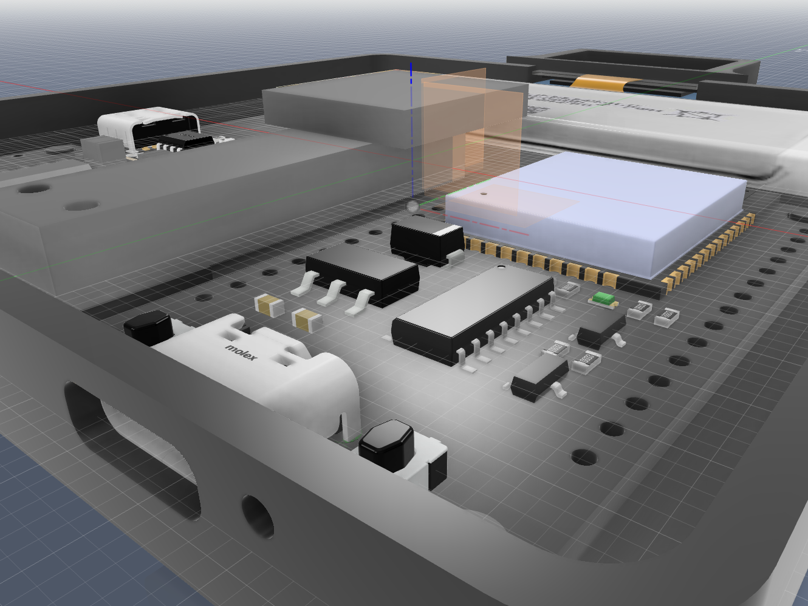

# inDecentScale
ESP32-based scale that emulates a "Decent Scale" via Bluetooth Low Energy (BLE), offering features like weight measurement, autotare, timer control, and power-off sequencing

Why? For use with Apps like Beanconqueror, etc. 

### STATUS: Currently in Prototyping stage!

## Disclaimer: this code has not been tested!
There may be (probably a lot of) bugs and errors! You have been warned.

#### Current Material cost estimate: <15€ 

#### Status: Most of the code has been written, though untested because I am still waiting on parts. 

#### Design features: 
 - 128x64 OLED screen
 - Wood (Coaster) Weighing Platform
 - Lithium Battery powered with BMS
 - USB C charging 
##### !Maybe! in the Future:
 - battery voltage reading with voltage divider with 2 equal resistors connected to GND + VBAT pins 
 
## Concept Renders
These pictures are a Render of the 3D design and are subject to change.
 With cover  
 Without cover  
 Calibration button

## BOM - Bill of Materials
Coming soon!

## Dependencies
 - VScode
 - platformio taking care of libraries, environment and flashing

### Additional Info 
#### DecentScale API info:
[DecentScale API](https://decentespresso.com/decentscale_api)

## Contribution and Use
You are free to commit to this Project make PR and use the code and designs for your own projects.

## Credits
Big thanks to John Buckman and the whole Decent Espresso Team for what they've done for the community. Thanks to all the contributors of Beanconqueror